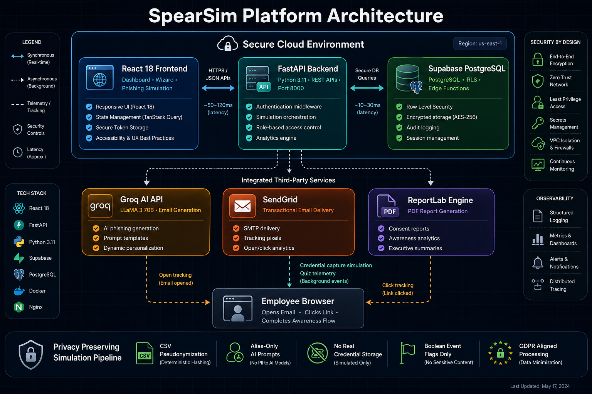
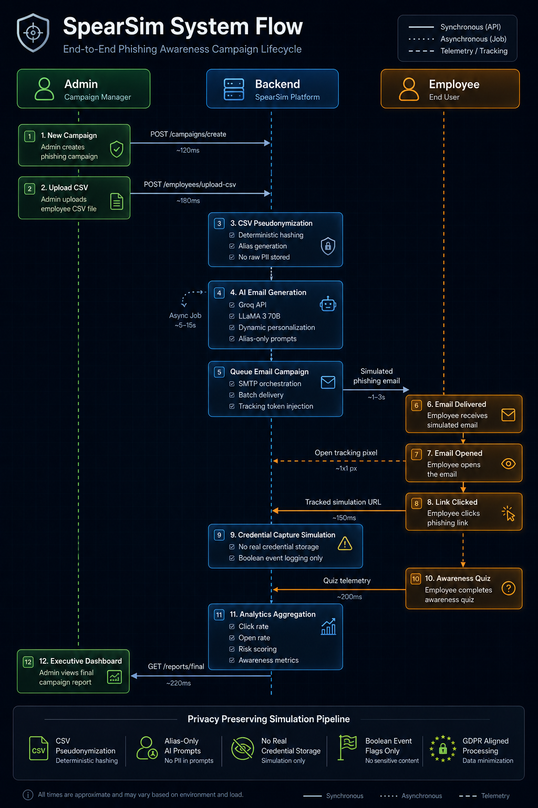

https://github.com/user-attachments/assets/9bf20a6c-b421-4383-8ddd-5d6aa9db87d1

# SpearSim

> **GDPR-compliant spear phishing simulation platform for enterprise security awareness training**

Built with FastAPI, React, Groq LLaMA3, SendGrid, and Supabase. Simulates realistic phishing attacks against your own organisation, tracks behavioural responses, generates AI-powered remediation advice, and enforces full GDPR compliance — all from a single platform.

[](https://fastapi.tiangolo.com)
[](https://reactjs.org)
[](https://supabase.com)
[](https://groq.com)
[](LICENSE)

---

## Table of Contents

- [Overview](#overview)
- [Architecture](#architecture)
- [System Flow](#system-flow)
- [Features](#features)
- [GDPR Compliance](#gdpr-compliance)
- [Tech Stack](#tech-stack)
- [Local Setup](#local-setup)
- [Environment Variables](#environment-variables)
- [API Reference](#api-reference)
- [Project Structure](#project-structure)
- [Ethical Use Disclaimer](#ethical-use-disclaimer)

---

## Overview

SpearSim enables security teams to run authorised phishing simulations against their own employees. It generates personalised phishing emails using LLaMA3 via Groq, tracks open/click/credential events in real time, and presents an awareness training screen to any employee who falls for the simulation. The platform is built privacy-first — no real credentials are ever stored, all employee data is pseudonymised, and every action is logged for GDPR Article 30 compliance.

**Key differentiators:**
- LLM-generated spear phishing emails personalised per employee role
- Full GDPR compliance gate — campaign cannot launch without lawful basis + signed PDF
- Real-time phishing event tracking with per-employee risk scoring
- Awareness training quiz after the phish reveal — measures actual learning
- AI-generated remediation advice per employee based on their behaviour
- Automatic 90-day data retention with daily cleanup Edge Function

---

## Architecture

<p align="center">
  
</p>

---

## System Flow

<p align="center">
  
</p>
---

## Features

### Campaign Management
- **3-step campaign wizard** — setup, CSV upload, GDPR consent + launch
- **Campaign notes** — internal context field for each campaign
- **Email preview** — generate and review a sample phishing email before sending
- **Re-send emails** — retry delivery for employees who haven't interacted yet
- **Delete campaign** — with cascade delete of all related events and employee data
- **Mark complete** — close active campaigns manually

### LLM-Powered Phishing Emails
- Personalised emails generated per employee using **Groq LLaMA3-70B**
- Role-aware content — different email style for HR Manager vs Software Engineer
- 5 scenario types: **IT Support, HR, Finance, CEO Fraud, Vendor**
- 3 difficulty levels: **Low** (obvious red flags), **Medium** (subtle), **High** (convincing)
- Batch generation with graceful failure handling per employee

### Real-Time Tracking
- **Open tracking** — 1×1 pixel GIF served at `/track/open/{uuid}`
- **Click tracking** — redirect endpoint logs click then forwards to awareness page
- **Credential tracking** — boolean event flag only, zero credential storage
- **Duplicate prevention** — deduplication logic prevents double-counting per employee

### Awareness Training & Quiz
- Post-phish awareness screen shows scenario-specific **red flags**
- **3-question awareness quiz** after the reveal screen
- Per-question scoring with correct answer feedback
- Quiz scores stored in `quiz_results` table
- **Quiz completion rate** and **average score** shown on campaign dashboard

### Reporting & Analytics
- **Campaign report** with open rate, click rate, cred rate, risk score
- Industry benchmark comparison (32% baseline)
- **Per-employee risk level** — Low / Medium / High based on actions taken
- **AI-generated remediation advice** per employee via Groq
- Expandable remediation rows in the employee breakdown table
- Sortable employee table by alias, role, opened, clicked, creds, risk
- **PDF report** export via ReportLab
- **CSV report** export with full breakdown

### Dashboard
- Stats overview — total campaigns, active campaigns, employees targeted, avg risk score
- **Search and filter** campaigns by name, org, or status
- **Manual refresh** button with animated spinner
- **Auto-refresh** (30s) — only activates when active campaigns exist, auto-disables when none
- **Backend offline detection** — banner shown when backend is unreachable, polling paused

### GDPR Compliance Dashboard
- Lawful basis tracking per campaign
- Right to erasure — alias-level deletion with receipt PDF
- Retention countdown — warning banner when data expires in < 14 days
- Full audit log viewer — paginated, filterable by action type
- Active campaigns retention monitor

### Organisation Management
- **Create organisation modal** — inline in the new campaign flow, no API docs needed
- Domain enforcement — CSV upload rejects emails not matching org domain
- Multi-org support

---

## GDPR Compliance

| Feature | GDPR Article | Implementation |
|---|---|---|
| **Pseudonymised LLM prompts** | Art. 5(1)(f) | Real names replaced with `Employee_XXXX` aliases before any LLM call. Real names stored encrypted in `name_map` via Supabase Vault. |
| **Consent gate + authorization PDF** | Art. 6 | Campaign cannot launch without lawful basis selection, admin authority confirmation checkbox, and PDF download. |
| **90-day automatic data retention** | Art. 5(1)(e) | `auto_delete_at` set at campaign creation. Daily Supabase Edge Function deletes expired campaigns, employees, events, name_map entries, and quiz results. |
| **Right to erasure endpoint** | Art. 17 | `DELETE /api/gdpr/erase/{alias}` removes all employee data and generates a downloadable erasure receipt PDF. |
| **Domain whitelist enforcement** | Art. 5(1)(b) | CSV upload rejects any email not matching the registered organisation domain. Rejections logged to audit trail. |
| **Append-only audit logging** | Art. 30 | Every action (create, launch, upload, erase, export) logged with actor email, timestamp, IP address. No DELETE endpoint on audit_logs. |
| **Zero credential storage** | Art. 5(1)(c) | Fake login form records only a boolean `cred_entered` event flag. No credentials are stored, transmitted, or logged anywhere. |
| **Data minimisation on LLM** | Art. 5(1)(c) | LLM prompts include only alias + generic role. No name, email, or department sent to external API. |

---

## Tech Stack

| Layer | Technology | Purpose |
|---|---|---|
| Backend | FastAPI 0.111 + Python 3.11 | REST API, tracking endpoints, campaign logic |
| LLM | Groq API (llama-3.3-70b-versatile) | Phishing email generation, remediation advice |
| Email | SendGrid | Transactional email delivery |
| Frontend | React 18 + Vite + Tailwind CSS | SPA dashboard and phish page |
| Charts | Recharts | Engagement rate bar charts |
| Database | Supabase (PostgreSQL) | Data storage + Row Level Security |
| Edge Functions | Supabase Deno | Daily retention cleanup cron |
| PDF | ReportLab | Report and authorization PDF generation |
| Auth (planned) | Supabase Auth | Admin authentication |

---

## Local Setup

### Docker (recommended)
```bash
cp backend/.env.example backend/.env
# Fill in backend/.env with your API keys
docker compose up --build
```
Frontend: http://localhost:3000
Backend: http://localhost:8000
API Docs: http://localhost:8000/api/docs

### Prerequisites

- Python 3.11+
- Node.js 18+
- Supabase project
- Groq API key (free tier: [console.groq.com](https://console.groq.com))
- SendGrid API key (free tier: [sendgrid.com](https://sendgrid.com))

### 1. Database

Run `supabase/schema.sql` in your Supabase SQL Editor. Then run the quiz results table separately:

```sql
CREATE TABLE IF NOT EXISTS quiz_results (
    id UUID PRIMARY KEY DEFAULT uuid_generate_v4(),
    employee_id UUID NOT NULL REFERENCES employees(id) ON DELETE CASCADE,
    campaign_id UUID NOT NULL REFERENCES campaigns(id) ON DELETE CASCADE,
    score INTEGER NOT NULL,
    answers JSONB,
    submitted_at TIMESTAMPTZ NOT NULL DEFAULT NOW()
);

ALTER TABLE campaigns ADD COLUMN IF NOT EXISTS notes TEXT;
ALTER TABLE employees ADD COLUMN IF NOT EXISTS scenario_override TEXT;

CREATE INDEX IF NOT EXISTS idx_quiz_results_campaign ON quiz_results(campaign_id);
CREATE INDEX IF NOT EXISTS idx_quiz_results_employee ON quiz_results(employee_id);
ALTER TABLE quiz_results ENABLE ROW LEVEL SECURITY;
CREATE POLICY "Authenticated users can manage quiz_results" ON quiz_results FOR ALL TO authenticated USING (true);
CREATE POLICY "Public can insert quiz_results" ON quiz_results FOR INSERT TO anon WITH CHECK (true);
```

Deploy the retention Edge Function:
```bash
supabase functions deploy retention-cleanup
```

Schedule it daily via Supabase Dashboard → Edge Functions → Schedule (`0 0 * * *`).

### 2. Backend

```bash
cd backend
python -m venv venv
source venv/bin/activate        # Windows: venv\Scripts\activate
pip install -r requirements.txt
cp .env.example .env            # Fill in your API keys
uvicorn app.main:app --reload --port 8000
```

API docs: [http://localhost:8000/api/docs](http://localhost:8000/api/docs)

### 3. Background Queue (Redis + Celery + Flower)

For asynchronous email dispatch and PDF generation in the background:
```bash
# 1. Start Redis via Docker
docker run -d -p 6379:6379 redis:5.0.1

# 2. Start Celery worker (in backend directory)
celery -A celery_worker worker --loglevel=info

# 3. Start Flower dashboard (monitoring)
celery -A celery_worker flower --port=5555
```
Flower Dashboard: [http://localhost:5555](http://localhost:5555)

*(Note: If Redis is not running or unconfigured, SpearSim gracefully falls back to inline synchronous execution).*

### 4. Frontend

```bash
cd frontend
npm install
npm run dev
```

App: [http://localhost:3000](http://localhost:3000)

### 4. Quick Start (Windows)

Double-click `start.bat` in the project root. It will:
- Check Python and Node.js are installed
- Create a virtual environment if needed
- Install all dependencies automatically
- Launch backend and frontend in separate terminal windows
- Open the browser after 4 seconds

---

## Environment Variables

### `backend/.env`

| Variable | Description |
|---|---|
| `SUPABASE_URL` | Supabase project URL |
| `SUPABASE_ANON_KEY` | Supabase publishable key |
| `SUPABASE_SERVICE_ROLE_KEY` | Supabase secret key (bypasses RLS — backend only) |
| `GROQ_API_KEY` | Groq API key |
| `GROQ_MODEL` | Model name (default: `llama-3.3-70b-versatile`) |
| `SENDGRID_API_KEY` | SendGrid API key |
| `SENDGRID_FROM_EMAIL` | Verified sender email |
| `SENDGRID_FROM_NAME` | Sender display name |
| `APP_BASE_URL` | Backend URL for tracking links (e.g. `http://localhost:8000`) |
| `FRONTEND_URL` | Frontend URL for redirects (e.g. `http://localhost:3000`) |
| `SECRET_KEY` | Random secret string (min 32 chars) |
| `ENVIRONMENT` | `development` or `production` |
| `ALLOWED_ORIGINS` | Comma-separated CORS origins |

---

## API Reference

```
Organizations
  POST   /api/organizations/              Create organisation
  GET    /api/organizations/              List organisations

Campaigns
  POST   /api/campaigns/create            Create campaign
  GET    /api/campaigns/                  List all campaigns
  GET    /api/campaigns/{id}              Get campaign details
  POST   /api/campaigns/{id}/consent      Update GDPR consent
  POST   /api/campaigns/{id}/launch       Launch campaign (sends emails)
  POST   /api/campaigns/{id}/complete     Mark campaign complete
  POST   /api/campaigns/{id}/resend       Re-send to non-interacting employees
  DELETE /api/campaigns/{id}              Delete campaign + all related data
  GET    /api/campaigns/{id}/preview-email  Preview LLM-generated email
  GET    /api/campaigns/{id}/report       Get report + AI remediation
  GET    /api/campaigns/{id}/report/pdf   Download PDF report
  GET    /api/campaigns/{id}/report/csv   Download CSV report

Employees
  POST   /api/employees/upload-csv        Upload employee CSV
  GET    /api/employees/{campaign_id}     List employees (alias only)

Tracking
  GET    /track/open/{uuid}               Open pixel (1×1 GIF)
  GET    /track/click/{uuid}              Click tracker → redirect to awareness page
  POST   /track/cred/{uuid}              Credential submission tracker
  POST   /track/quiz/{uuid}              Awareness quiz submission

Phish Page
  GET    /api/phish/{uuid}                Phish page context (red flags, scenario)

GDPR
  DELETE /api/gdpr/erase/{alias}          Article 17 right to erasure
  GET    /api/gdpr/erase/{alias}/receipt  Download erasure receipt PDF
  GET    /api/gdpr/audit-logs             Paginated audit log
  POST   /api/gdpr/consent-pdf/{id}       Generate authorisation PDF
  GET    /api/gdpr/active-campaigns       Retention dashboard data
```

---

## Project Structure

```
SpearSim/
├── start.bat                             # Windows one-click launcher
├── supabase/
│   ├── schema.sql                        # Full database schema + RLS policies
│   └── functions/
│       └── retention-cleanup/
│           └── index.ts                  # Daily GDPR data retention Edge Function
├── backend/
│   ├── app/
│   │   ├── main.py                       # FastAPI app + CORS + router registration
│   │   ├── config.py                     # Pydantic settings from .env
│   │   ├── database.py                   # Supabase client factory (anon + admin)
│   │   ├── models.py                     # All Pydantic request/response models
│   │   ├── utils.py                      # Shared utilities (alias gen, IP extraction)
│   │   ├── routes/
│   │   │   ├── campaigns.py              # Campaign CRUD, launch, resend, delete, reports
│   │   │   ├── employees.py              # CSV upload + pseudonymisation
│   │   │   ├── tracking.py              # Open/click/cred/quiz tracking
│   │   │   ├── gdpr.py                  # Erasure, audit logs, consent PDF
│   │   │   └── organizations.py          # Organisation management
│   │   └── services/
│   │       ├── llm_service.py            # Groq batch email generation + remediation
│   │       ├── email_service.py          # SendGrid delivery
│   │       ├── pdf_service.py            # ReportLab PDF generation
│   │       └── audit_service.py          # Audit logging + action constants
│   ├── requirements.txt
│   └── .env.example
└── frontend/
    ├── src/
    │   ├── App.jsx                       # React Router setup
    │   ├── lib/api.js                    # Axios API client + interceptors
    │   ├── components/
    │   │   ├── Layout.jsx                # Sidebar navigation
    │   │   ├── StatCard.jsx              # Metric cards
    │   │   ├── StatusBadge.jsx           # Campaign status pill
    │   │   ├── RiskBadge.jsx             # Employee risk level badge
    │   │   ├── LoadingSpinner.jsx        # Loading state
    │   │   └── EmptyState.jsx            # Empty list state
    │   └── pages/
    │       ├── Dashboard.jsx             # Campaign overview + search/filter
    │       ├── NewCampaign.jsx           # 3-step creation wizard + org modal
    │       ├── CampaignDetail.jsx        # Report, chart, employee breakdown
    │       ├── Compliance.jsx            # GDPR audit log + erasure dashboard
    │       └── PhishPage.jsx             # Fake login → awareness screen + quiz
    ├── package.json
    └── vite.config.js                    # Vite dev server + API proxy
```

---

## CSV Format

Upload employee CSVs in this format:

```csv
email,role,name,scenario
alice@company.com,Software Engineer,Alice Smith,IT Support
bob@company.com,HR Manager,,HR
charlie@company.com,Finance Analyst,Charlie Brown,Finance
```

- `email` — required, must match organisation domain
- `role` — required, used in LLM prompt for personalisation
- `name` — optional, stored encrypted, never sent to LLM
- `scenario` — optional, overrides campaign default scenario per employee

---

## Ethical Use Disclaimer

SpearSim is designed exclusively for **authorised security awareness training** within organisations where the operator has explicit authority to conduct such simulations.

**This tool must only be used:**
- With proper organisational authorisation
- Under a valid GDPR lawful basis
- With the signed authorisation PDF on file
- Against email addresses belonging to your own organisation's domain

**This tool must never be used:**
- Against individuals or organisations without explicit authorisation
- To capture, store, or transmit real credentials
- For any malicious, deceptive, or unauthorised purpose

Misuse may violate computer fraud laws, data protection regulations, and employment law.

---

## Author

Built by [Sangamesh Girish Dandin](https://linkedin.com/in/sangamesh-girish-dandin-553b45247) — MSc AI student at National College of Ireland, specialising in AI Security.

GitHub: [@Sangamesh-dev](https://github.com/Sangamesh-dev) · Alias: **n0xvector**
